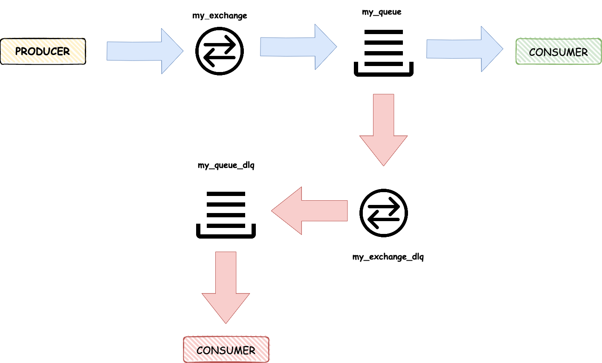
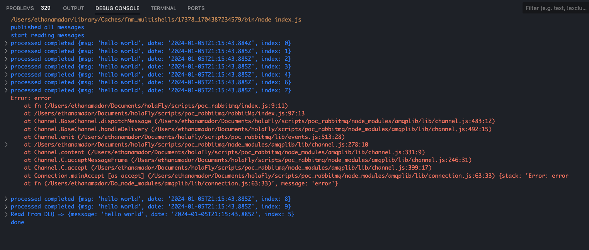

# rabbitMq

this is a poc to implement RabbitMq

*_Note:_* to run this project, needs to a RabbitMQ instance or execute the `docker-compose.yml` in the path main. 

```.env
RABBIT_MQ_HOST=localhost
RABBIT_MQ_PORT=5672
RABBIT_MQ_USER=guest
RABBIT_MQ_PASSWORD=guest
RABIIT_MQ_PROTOCOL=amqp
```

## Diagram



## Screenshot 


